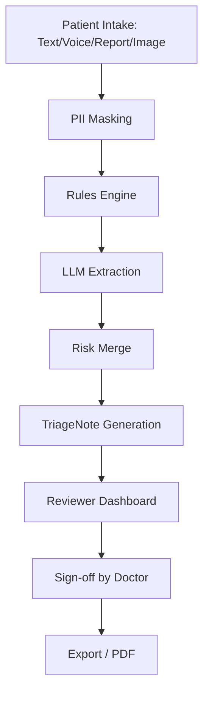

# Healthcare Triage Assistant - Architecture

## System Flowchart

## Tech Stack
| Component | Technology |
| --- | --- |
| Frontend | React, TailwindCSS |
| Backend | Python, FastAPI |
| AI/LLM | OpenAI / Anthropic APIs |
| Database | PostgreSQL |

## Component Descriptions
- **Intake Module**: Gathers patient data in multiple formats including text, voice, and medical reports.
- **PII Masking**: Removes Personally Identifiable Information to ensure data privacy.
- **Rules Engine**: Evaluates preliminary structured inputs against defined medical heuristics (red flags).
- **LLM Extraction**: Uses Large Language Models to extract relevant symptoms and context from unstructured data.
- **Risk Merge**: Combines outputs from the rules engine and LLM to assess triage priority.
- **Reviewer Dashboard**: Interface for healthcare professionals to review the system's generated TriageNote.

> [!NOTE] 
> Architecture diagram - not a production system.
